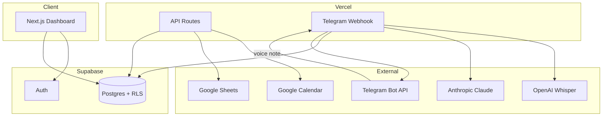

# Personal OS — Architecture

## Overview

Personal OS is a single-user dashboard and automation hub: a **Next.js** frontend, **Supabase** as the system of record, **Google APIs** for calendar and finance, and a **Telegram → Whisper → Claude → Supabase** voice pipeline on **Vercel serverless**.



## Repository layout

```
personal-os/
├── src/
│   ├── app/                    # Next.js App Router
│   │   ├── page.tsx            # Dashboard (mock → live data)
│   │   └── api/
│   │       ├── telegram/webhook/   # Voice automation entry
│   │       ├── calendar/           # Google Calendar proxy
│   │       ├── finance/sync/       # Sheets → Supabase
│   │       └── auth/google/        # OAuth kickoff
│   ├── components/dashboard/   # UI widgets
│   └── lib/
│       ├── supabase/           # Browser, server, admin clients
│       ├── google/             # Calendar + Sheets
│       ├── telegram/           # Bot helpers
│       ├── ai/                 # Whisper, classify, ingest
│       └── types/
├── supabase/migrations/        # Schema + RLS
├── ARCHITECTURE.md
└── BUILD_GUIDE.md
```

## Data model (Supabase)

| Table | Purpose |
|-------|---------|
| `profiles` | User settings, `telegram_chat_id`, finance visibility |
| `tasks` | Key tasks / priorities |
| `habits` + `habit_subtasks` + `habit_completions` | Daily habits with checkboxes |
| `crm_contacts` + `crm_interactions` | Lightweight CRM |
| `nutrition_entries` | Meal logging |
| `journal_entries` | Journaling |
| `finance_snapshots` | Synced from Google Sheets |
| `voice_ingestions` | Audit log for Telegram pipeline |

All tables use **RLS** scoped to `auth.uid()`. The Telegram webhook uses the **service role** only on the server.

## Voice automation pipeline

1. User sends voice note to Telegram bot.
2. Telegram POSTs update to `POST /api/telegram/webhook` (secret header validated).
3. Resolve `user_id` via `profiles.telegram_chat_id`.
4. Download audio → **Whisper** transcript.
5. **Claude** returns JSON classification (`task`, `crm`, `journal`, `nutrition`, `habit_note`).
6. `ingestClassification()` inserts into the correct table + `voice_ingestions`.
7. Bot replies with confirmation.

## Security notes

- Never expose `SUPABASE_SERVICE_ROLE_KEY` or `TELEGRAM_BOT_TOKEN` to the client.
- Set `TELEGRAM_WEBHOOK_SECRET` and validate on every webhook request.
- Store Google `refresh_token` in env (or encrypted in DB per user for multi-user later).
- Finance Pulse is **hidden by default** in the UI; `profiles.finance_pulse_visible` can persist preference.

## Deployment target

| Service | Role |
|---------|------|
| Vercel | Next.js + API routes (webhook, 60s timeout) |
| Supabase | Postgres, Auth, optional Edge Functions later |
| Telegram | Bot + webhook URL |
| Google Cloud | OAuth app (Calendar + Sheets scopes) |
